# Pixel Quest Memory Game

Pixel Quest Memory Game is an Interactive Frontend Development project built with HTML, CSS, and JavaScript.

## Contents

- [Project Brief](#project-brief)
- [User Goals](#user-goals)
- [User Stories](#user-stories)
- [Site Owner Goals](#site-owner-goals)
- [Features](#features)
- [Planning and Design Evidence](#planning-and-design-evidence)
- [UX Design](#ux-design)
- [JavaScript Logic](#javascript-logic)
- [Testing](#testing)
- [Evidence](#evidence)
- [Deployment](#deployment)
- [Credits and Attribution](#credits-and-attribution)

## Project Brief

Pixel Quest Memory Game is a retro-style memory and pattern game. The player watches a sequence of glowing tiles, then repeats that sequence from memory. Each successful round adds one more step, increasing the challenge over time.

The project is being created for Code Institute Project 2: Interactive Frontend Development. It focuses on custom JavaScript interactivity, responsive layout, clear feedback, and a simple browser-based game loop.

## User Goals

- Understand how to play quickly.
- Start a game easily.
- Choose a difficulty level.
- Receive clear feedback after each action.
- See score, round, lives, and high score.
- Play comfortably on mobile, tablet, and desktop screens.

## User Stories

### First-Time Player

- As a first-time visitor, I want the purpose of the site to be obvious so that I know it is a memory game.
- As a first-time visitor, I want short instructions so that I can start playing without reading a long guide.
- As a first-time visitor, I want clear feedback after each action so that I understand whether I am playing correctly.

### Returning Player

- As a returning player, I want my high score to be saved so that I can try to beat it later.
- As a returning player, I want to choose a difficulty so that the game remains challenging.
- As a returning player, I want a reset option so that I can restart quickly.

### Accessibility and Device User

- As a keyboard user, I want to navigate and play without a mouse so that the game is fully usable.
- As a mobile player, I want the tile board and controls to fit my screen so that I can play comfortably.
- As a screen reader user, I want status changes to be announced so that score, lives, and prompts are understandable.

## Site Owner Goals

- Provide a playable memory game using HTML, CSS, and JavaScript.
- Demonstrate meaningful user interaction and dynamic front-end responses.
- Keep the interface easy to navigate.
- Store a high score locally for repeat play.
- Build a project that can be deployed to GitHub Pages.

## Features

### Implemented Features

- Semantic single-page layout with Home, How to Play, Play Game, Scores, and About sections.
- Sticky main navigation with anchor links.
- Four-tile memory game board.
- Random sequence generation that adds one step each round.
- Sequence playback with visible tile highlights.
- Player input checking with immediate feedback.
- Score, round, lives, and high score displays.
- Easy, Normal, and Hard difficulty settings.
- Local high score storage using `localStorage`.
- High score clear flow with confirmation.
- Keyboard-accessible controls and tiles.
- ARIA live feedback for dynamic game messages and status changes.
- Responsive layout for mobile, tablet, and desktop screens.

### Future Features

- Optional sound effects with a mute control.
- Timed challenge mode.
- Separate leaderboard table for recent local results.
- Animated start countdown.
- Additional tile themes for users who prefer different visual styles.

## Planning and Design Evidence

### Wireframes

No original hand-drawn or PDF wireframes were present in the repository. The visual below is a generated wireframe-style preview based on the current project layout, included to make the page structure visible directly in the README.

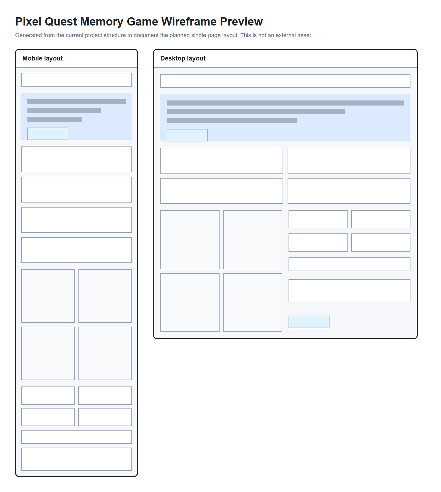

Supporting file: [wireframes-preview.html](docs/evidence/planning/wireframes-preview.html)

## UX Design

### Information Architecture

The site is structured as a single-page application-style experience:

- **Home** introduces the game and provides the primary Start Game call to action.
- **How to Play** explains the rules in four short steps.
- **Play Game** contains the interactive board, difficulty selector, controls, feedback, and current game statistics.
- **Scores** shows the last result, saved high score, and high score clear control.
- **About** explains the project purpose and confirms that the game code is original.

This order supports the main user journey: understand the game, start playing, receive feedback, and review progress.

### Design Choices

The visual design uses a dark retro arcade style with bright cyan, pink, yellow, and green tile colours. The game board is intentionally simple so the sequence remains the focus. Cards and panels are used only where they group repeated or interactive information, such as status values and scores.

The layout is mobile-first. The board keeps a square aspect ratio, controls remain touch-friendly, and larger screens use a two-column play area for better scanning.

### Accessibility Rationale

- Semantic HTML landmarks and headings provide a clear page structure.
- All controls are buttons, links, or form controls.
- Tiles can be activated by mouse, touch, Enter, or Space.
- ARIA live regions announce game messages and status changes.
- Visible focus states make keyboard navigation clear.
- Feedback text explains success, mistakes, lives, and next steps without relying only on colour.

## JavaScript Logic

The game logic lives in [assets/js/script.js](assets/js/script.js).

### State Management

The `gameState` object stores the current sequence, player input, score, round, lives, difficulty, high score, playback state, and playback cancellation id. Keeping these values together makes each UI update predictable.

### Game Flow

1. The player selects a difficulty.
2. `startGame()` resets the current run, locks the difficulty selector, generates the first sequence step, and starts playback.
3. `generateNextStep()` adds a random tile index to the sequence.
4. `playSequence()` flashes each tile once per sequence step, then allows player input.
5. `handleTileClick()` records mouse, touch, or keyboard tile input.
6. `checkPlayerInput()` compares the latest player input with the sequence.
7. `completeRound()` awards points, adds a new sequence step, and starts the next round.
8. `handleWrongInput()` removes a life and replays the same round, or calls `endGame()` if no lives remain.

### Difficulty

Each difficulty controls starting lives, playback delay, and points per round:

- Easy: more lives, slower playback, lower points.
- Normal: balanced lives, playback, and scoring.
- Hard: fewer lives, faster playback, higher points.

Difficulty changes the playback speed and scoring, but each sequence step still flashes once.

### Local Storage

The highest score is stored in the browser with the `pixelQuestHighScore` key. The game loads this value on page load, updates it after game over when the player beats the previous score, and removes it when the player confirms the clear high score action.

## Testing

Testing documentation is maintained in [docs/testing.md](docs/testing.md).

The testing document includes:

- Part 1 smoke checks.
- Part 2 testing matrix.
- Game functionality testing.
- Responsive testing.
- Keyboard testing.
- Bugs and fixes.
- Local validation checks.

## Evidence

Evidence folders are prepared under [docs/evidence](docs/evidence):

- [Screenshots](docs/evidence/screenshots/readme.md)
- [Validation](docs/evidence/validation/readme.md)
- [Lighthouse](docs/evidence/lighthouse/readme.md)
- [Manual testing](docs/evidence/manual-testing/readme.md)

### Responsive Screenshots

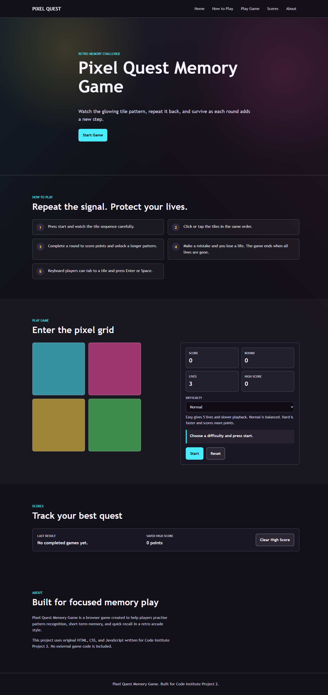

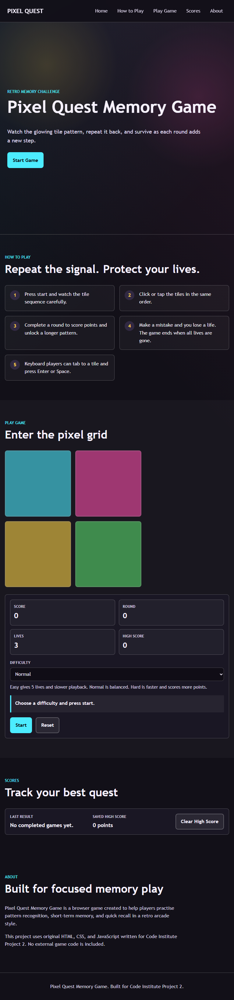

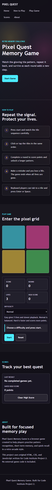

### Game Interface Evidence

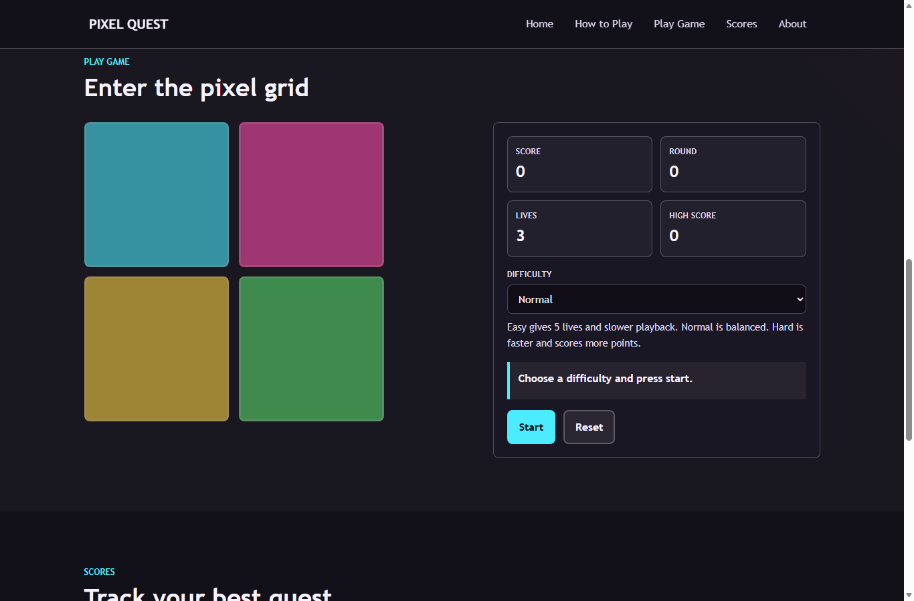

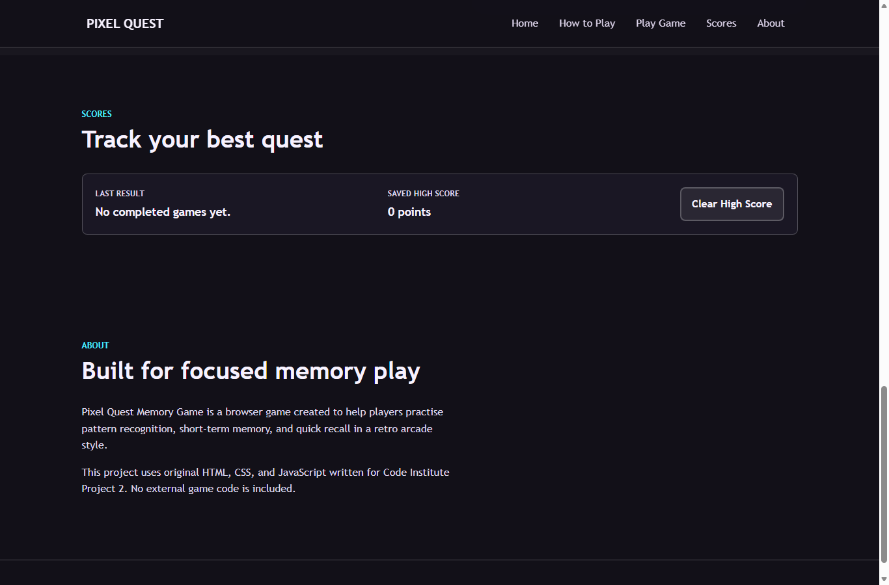

### Validation Evidence

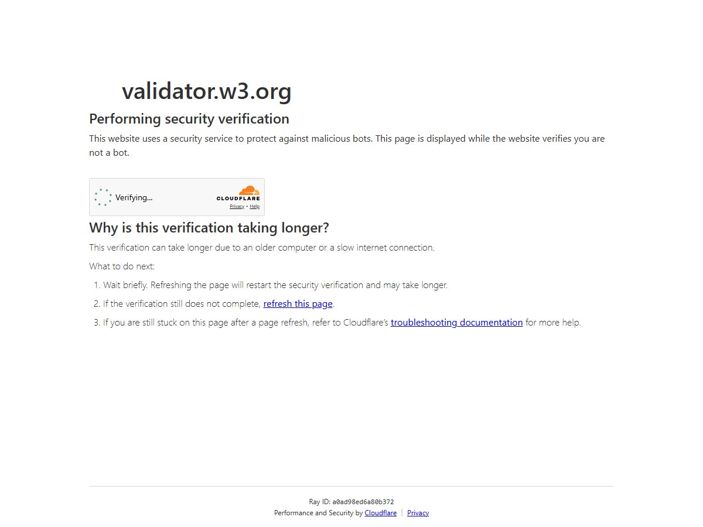

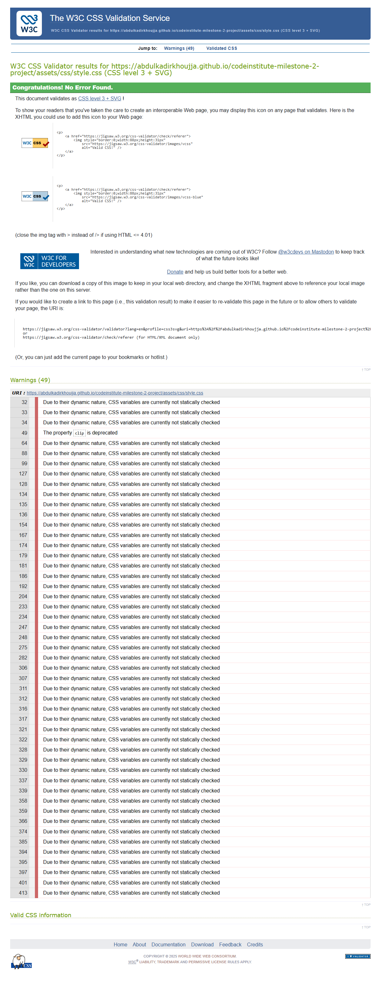

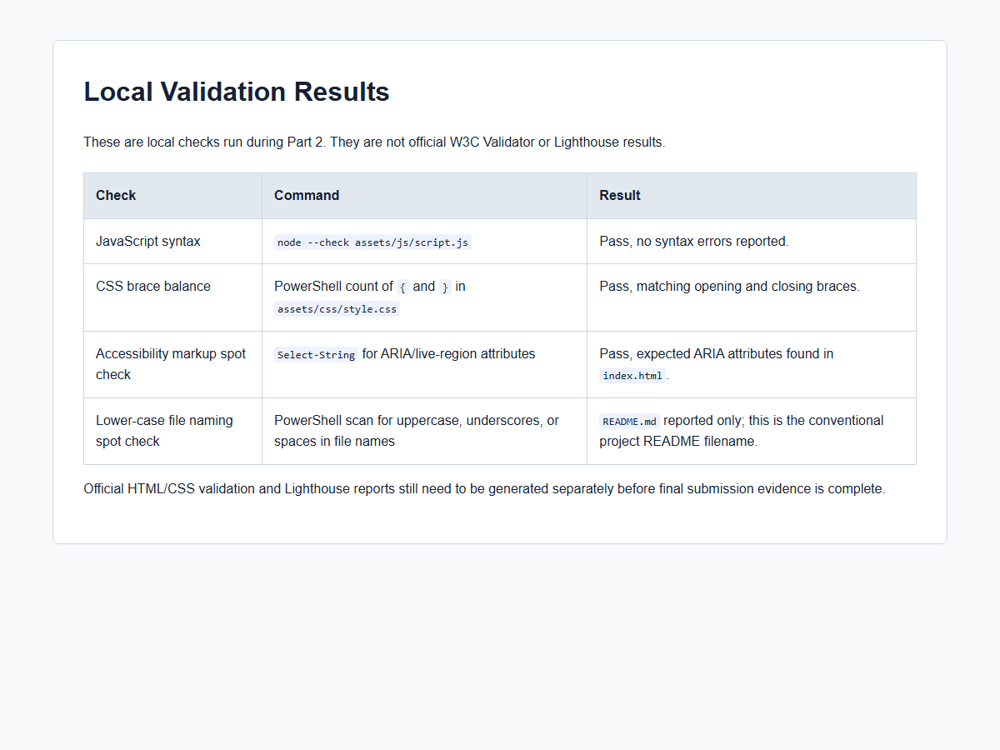

Supporting validation files:

- [Local validation notes](docs/evidence/validation/local-validation-results.md)
- [Local validation HTML view](docs/evidence/validation/local-validation-results.html)

### Lighthouse Evidence

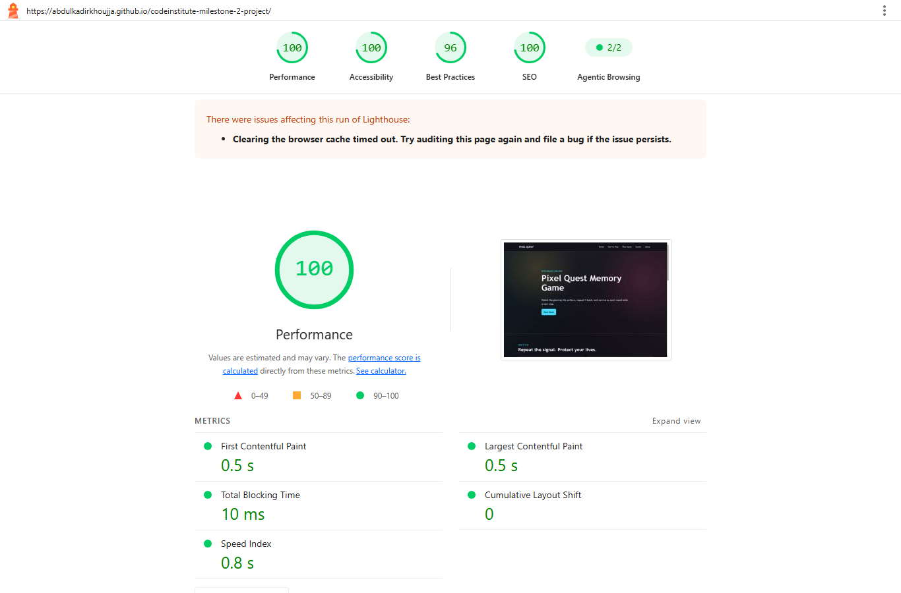

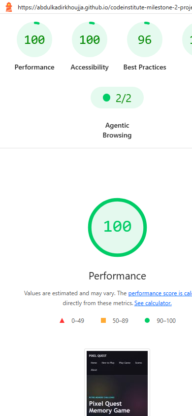

Supporting Lighthouse reports:

- [Desktop Lighthouse HTML report](docs/evidence/lighthouse/lighthouse-desktop-report.report.html)
- [Desktop Lighthouse JSON report](docs/evidence/lighthouse/lighthouse-desktop-report.report.json)
- [Mobile Lighthouse HTML report](docs/evidence/lighthouse/lighthouse-mobile-report.report.html)
- [Mobile Lighthouse JSON report](docs/evidence/lighthouse/lighthouse-mobile-report.report.json)

### Manual Testing Evidence

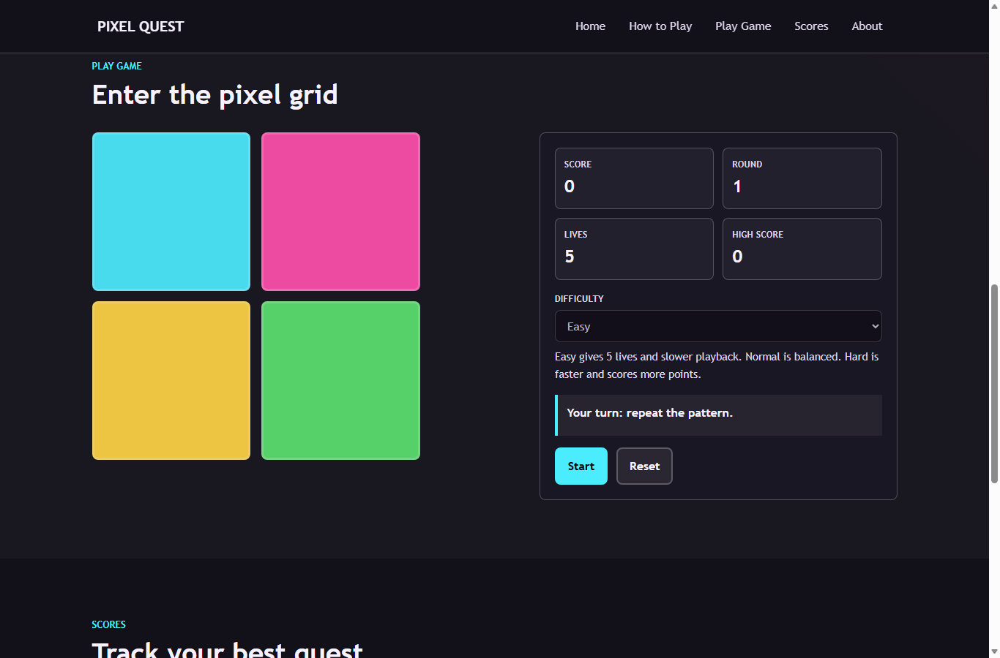

Supporting testing files:

- [Testing documentation](docs/testing.md)
- [Gameplay regression report](docs/gameplay-regression-report.md)
- [First-time playtest report](docs/playtest-report.md)

## Deployment

The project is designed to be deployed with GitHub Pages because it is a static HTML, CSS, and JavaScript site.

### GitHub Pages Steps

1. Push the latest `main` branch to GitHub.
2. Open the GitHub repository.
3. Go to **Settings**.
4. Select **Pages** from the sidebar.
5. Under **Build and deployment**, choose **Deploy from a branch**.
6. Select the `main` branch and `/root` folder.
7. Save the settings.
8. Wait for GitHub Pages to publish the site.

### Live Site

`https://abdulkadirkhoujja.github.io/codeinstitute-milestone-2-project/`

## Credits and Attribution

### Code

All HTML, CSS, and JavaScript in this project was written specifically for Pixel Quest Memory Game.

No code was reused from the previous gym website project.

### Assets

No external images, fonts, icons, audio, or game assets are used in the current project build.

### Learning References

General reference was made to standard HTML, CSS, JavaScript, accessibility, and GitHub Pages concepts. No tutorial code was copied into the project.
